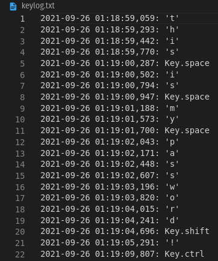

<p align="center">
 </a>
</p>

<h3 align="center">Simple Python Keylogger </h3>

---

<p align="center"> A simple keylogger made with python
    <br> 
</p>

## 📝 Table of Contents
- [Getting Started](#getting_started)
- [Deployment](#deployment)
- [Usage](#usage)
- [Built Using](#built_using)
- [Author](#authors)

## 🏁 Getting Started <a name = "getting_started"></a>

This is just an example to practice cybersecurity related topics, don't use this software with malicoius intent.

These instructions will get you a copy of the project up and running on your local machine for development and testing purposes. See [deployment](#deployment) for notes on how to deploy the project on a live system.

### Prerequisites

Make sure to have already python3 and pip3

### Deployment <a name="deployment"></a>

``` git clone https://github.com/Salvatore-Rendo/simple-python-keylogger ```

``` cd simple-python-keylogger ```

``` pip3 install -r requirements.txt ```

## 🎈 Usage <a name="usage"></a>

 NOTE : If you want to change directory and the file name of the stored keylogs, you can add those inside the log_directory and log_file_name variables.

``` python3 simple-python-keylogger```

Example of the log file :
<br>
</a>

## ⛏️ Built Using <a name = "built_using"></a>

- [Python](https://www.python.org/)

## ✍️ Author <a name = "authors"></a>

- [@Salvatore-Rendo](https://github.com/Salvatore-Rendo) - Idea & Initial work
